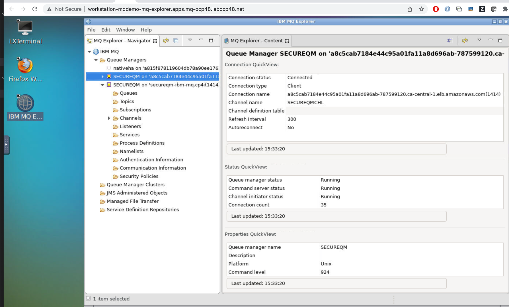
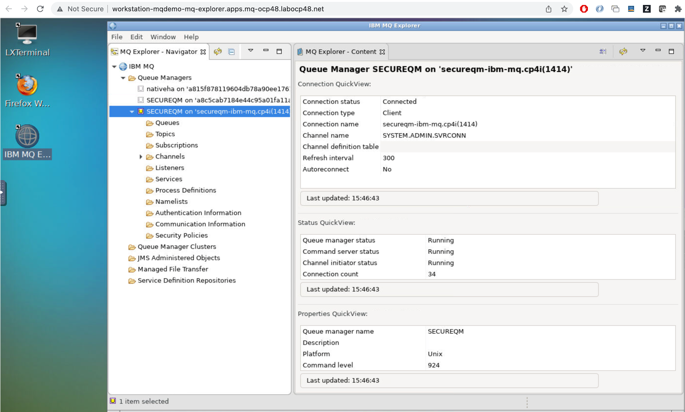
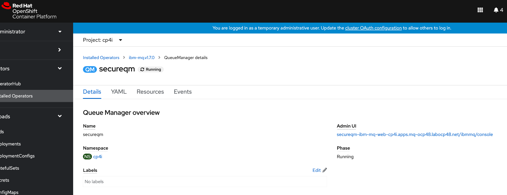
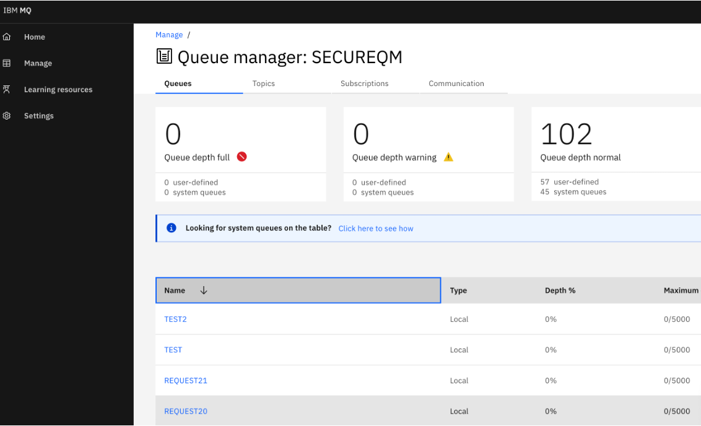
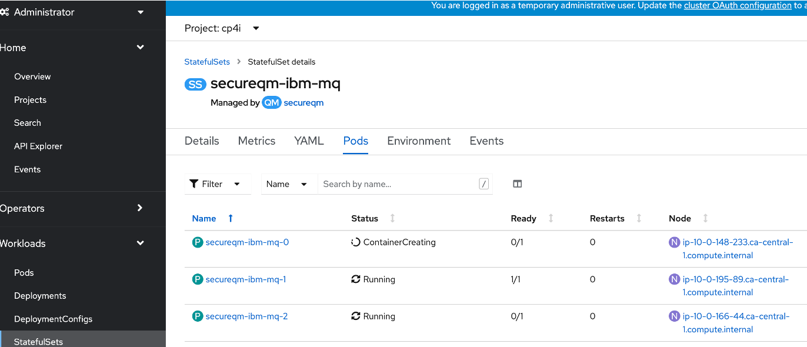
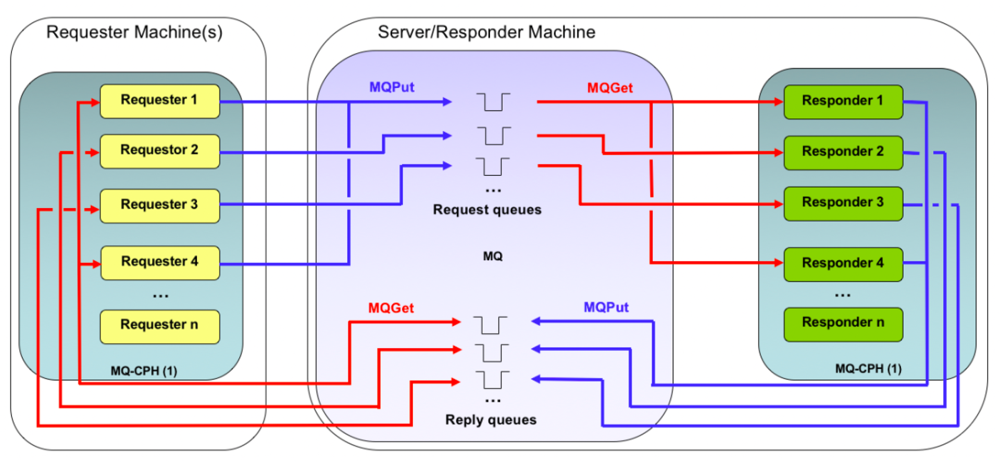

# mq-perf-harness

## 1. Build and deploy NativeHA MQ instance
https://www.ibm.com/docs/en/ibm-mq/9.2?topic=manager-example-configuring-tls

```
cd  secureqm
oc apply -f secureqm-cm.yaml
oc apply -f secureqm-secret.yaml
oc apply -f secureqm-qm.yaml
oc apply -f secureqm-lb.yaml
```

Test 
Update /Users/yaro/projects/mq-perf-harness/secureqm/CCDT.json with correct LB endpoint
```
oc get svc |grep LoadBalancer

export MQCCDTURL=/Users/yaro/projects/mq-perf-harness/secureqm/CCDT.json 
export MQSSLKEYR=/Users/yaro/projects/mq-perf-harness/ssl/key 

/opt/mqm/samp/bin/amqsputc TEST SECUREQM
/opt/mqm/samp/bin/amqsgetc TEST SECUREQM

```

## 2. Connect classic MQ Explorer to NativeHA MQ instance

Use existing MQ Explore instance or for quick setup deploy pre-installed MQ Explorer in a container using container image `yarod/workstation-mqdemo` 
One can run it locally on a docker-enabled laptop

```
docker run -p 6080:80 yarod/workstation-mqdemo
```
and then point the browser to 
```
http://localhost:6080/
```
Or run it on openshift:

```
oc new project mq-explorer
oc set serviceaccount deployment workstation-mqdemo runasanyuid
oc new-app yarod/workstation-mqdemo
oc expose svc/workstation-mqdemo
```
Then open the browser to the exposed route (in example shown below, the route is:    
`workstation-mqdemo-mq-explorer.apps.mq-ocp48.labocp48.net`):
```
oc get route
NAME                 HOST/PORT                                                   PATH   SERVICES             PORT     TERMINATION   WILDCARD
workstation-mqdemo   workstation-mqdemo-mq-explorer.apps.mq-ocp48.labocp48.net          workstation-mqdemo   80-tcp                 None
```
Copy MQ trust certificate store to MQ Explorer container 
```
oc cp ./ssl/key.jks <pod-name>:/root/Downloads
```
Configure MQ Explorer connection to external MQ endpoint exposed by load balancer in front of MQ container in OCP:
Open URL exposed by MQ Explorer route created earlier

Alternatively connect MQ Explorer to internal OCP endpoint:



## 3. Connect to NativeHA MQ instance cloud native UI
When instructed in QueueManager yaml, MQ Operator will instantiate a web UI, a cloud native MQ web UI, which is further integrated with CloudPak for Integration Platform navigator.
Using OpenShift console, navigate to the QueueManager instance in MQ Operator view and find the link to the MQ Web UI:

When MQ QueueManager is installed via MQ Operator, common services components of CP4I are installed in `ibm-common-services` namespace.
These component, among other things, enable single sign-on betweem MQ web UI and OpenShift platform. Once logged in MQ instance via OpenShift, one can manage QM via its webui:


## 4. Update MQ QueueManager
Lets add a queue to a running QM. All MQ objects are defined via MQSC script embedded in a config map defined in the `secureqm-cm.yaml`.  Lets add a directive to add a new queue.
### 4.1 Add MQSC defintion in local file (`secureqm-cm.yaml`)
```
define qlocal(NEWQUEUE) maxdepth(5000) DEFPSIST(YES) replace
```
### 4.2 Update confing map in OpenShift
```
oc apply -f secureqm-cm.yaml
```
You can see an updated ConfigMap in Openshift, but for this to take effect for running QM, we need to update the QM. With NativeHA, the QM is implemented as StatefulSet running 3 pods, a leader and 2 replicas. To update the QM StatefulSet, we use standard Kubernetes update mechanism which will do rolling updates of all pods:
```
oc rollout restart statefulset secureqm-ibm-mq
```

###


## 5. Run MQ Performance test harness
The MQ-CPH Performance Harness (hereafter referred to as MQ-CPH), is a native MQI interface (C/C++), performance test tool, based largely on the function and externals of the JMSPerfHarness tool (also on GitHub at https://github.com/ot4i/perf-harness). It provides an extensive set of performance messaging functionality, as well as many other features such as throttled operation (a fixed rate and/or number of messages), multiple destinations and live performance reporting. It is one of the many tools used by the IBM MQ performance team at Hursley, for tests ranging from a single client to more than 10,000 clients.
Perf harness scenario used here is shown below. The only correction is that `cphtestp` itself provides both requesters and responders shown on the diagram embedded in the harness:


Containerized MQ performance harness is published on https://github.com/ibm-messaging/cphtestp
The repo contents is included in this repo under `cphtestp` directory
To build a container with `cphtestp` tool, run `build.sh` or just use already built image `docker.io/yarod/cphtestp`
IMPORTANT: MQ test harness container uses MQ Client and requires TLS certs/files that match those used by the targer QM. The image `docker.io/yarod/cphtestp` includes copies of TLS certs matching SECUREQM QM created earlier here.
One can run MQ test harness locally on a laptop pointing to external MQ endpoint:

```
docker run -it --detach --net="host" \
--env MQ_QMGR_NAME=SECUREQM \
--env MQ_QMGR_HOSTNAME=a8c5cab7184e44c95a01fa11a8d696ab-787599120.ca-central-1.elb.amazonaws.com \
--env MQ_QMGR_PORT=1414 \
--env MQ_QMGR_CHANNEL=SECUREQMCHL \
--env MQ_AUTORECONNECT=MQCNO_RECONNECT \
--env MQ_QMGR_QREQUEST_PREFIX=REQUEST \
--env MQ_QMGR_QREPLY_PREFIX=REPLY \
--env MQ_RESPONDER_THREADS=100 \
--env MQ_MSGSIZE=2048 \
--env MQ_RUNLENGTH=30 \
--env MQ_TLS_CIPHER=ECDHE_RSA_AES_128_CBC_SHA256 \
--env MQ_TLS_CERTLABEL=mqservercert \
--env MQ_RESULTS_CSV=TRUE \
--env MQ_ERRORS=TRUE yarod/cphtestp
```
Examine the results is the container logs:
```
docker ps
CONTAINER ID   IMAGE            COMMAND          CREATED         STATUS         PORTS     NAMES
70628d0deac8   yarod/cphtestp   "./cphTest.sh"   4 seconds ago   Up 4 seconds             kind_wu

docker logs -f 70628d0deac8
----------------------------------------
Initialising test environment-----------
----------------------------------------
Mon Jun 6 17:17:15 UTC 2022
Running Persistent Messaging Tests
----------------------------------------
Testing QM: SECUREQM on host: a8c5cab7184e44c95a01fa11a8d696ab-787599120.ca-central-1.elb.amazonaws.com using port: 1414 and channel: SECUREQMCHL
Clients using auto reconnect option: MQCNO_RECONNECT
Using the following message sizes:
2048
TLS Cipher: ECDHE_RSA_AES_128_CBC_SHA256
----------------------------------------
Starting cph tests----------------------
----------------------------------------
Using the following progression of concurrent connections: 1 2 4 8 16 32 64 100
Using 100 responder threads
Mon Jun 6 17:17:15 UTC 2022
Running Persistent Messaging Tests
Testing QM: SECUREQM on host: a8c5cab7184e44c95a01fa11a8d696ab-787599120.ca-central-1.elb.amazonaws.com using port: 1414 and channel: SECUREQMCHL
Clients using auto reconnect option: MQCNO_RECONNECT
Using the following message sizes:
2048
TLS Cipher: ECDHE_RSA_AES_128_CBC_SHA256
Using the following progression of concurrent connections: 1 2 4 8 16 32 64 100
Using 100 responder threads
CPH Test Results
Mon Jun 6 17:17:48 UTC 2022
2048
threads=1
avgRate=6.68
CPU=1.22
Read=0.00
Write=0.01
Recv=0.00
Send=0.00
QM_CPU=3.78

threads=2
avgRate=12.83
CPU=1.34
Read=0.00
Write=0.00
Recv=0.00
Send=0.00
QM_CPU=4.34

threads=4
avgRate=22.20
CPU=1.91
Read=0.00
Write=0.00
Recv=0.00
Send=0.00
QM_CPU=4.58

threads=8
avgRate=51.80
CPU=3.20
Read=0.00
Write=0.00
Recv=0.00
Send=0.00
QM_CPU=4.99

threads=16
avgRate=100.65
CPU=5.59
Read=0.00
Write=0.00
Recv=0.00
Send=0.00
QM_CPU=5.70

threads=32
avgRate=203.00
CPU=11.54
Read=0.00
Write=0.00
Recv=0.01
Send=0.01
QM_CPU=6.86

threads=64
avgRate=342.57
CPU=21.05
Read=0.00
Write=0.01
Recv=0.02
Send=0.01
QM_CPU=8.87

threads=100
avgRate=352.16
CPU=25.43
Read=0.00
Write=0.01
Recv=0.02
Send=0.02
QM_CPU=10.32

# CSV Results
# TLS Cipher: ECDHE_RSA_AES_128_CBC_SHA256
# Mon Jun 6 17:17:18 UTC 2022
# Persistence, Msg Size, Threads, Rate (RT/s), Client CPU, IO Read (MB/s), IO Write (MB/s), Net Recv (Gb/s), Net Send (Gb/s), QM CPU
1,2048,1,6.68,1.22,0.00,0.01,0.00,0.00,3.78
1,2048,2,12.83,1.34,0.00,0.00,0.00,0.00,4.34
1,2048,4,22.20,1.91,0.00,0.00,0.00,0.00,4.58
1,2048,8,51.80,3.20,0.00,0.00,0.00,0.00,4.99
1,2048,16,100.65,5.59,0.00,0.00,0.00,0.00,5.70
1,2048,32,203.00,11.54,0.00,0.00,0.01,0.01,6.86
1,2048,64,342.57,21.05,0.00,0.01,0.02,0.01,8.87
1,2048,100,352.16,25.43,0.00,0.01,0.02,0.02,10.32
----------------------------------------
cph testing finished--------------------
----------------------------------------
```

### Run MQ Test Harness in OpenShift
Use kubernetes job to run the `cphtestp` container on OpenShift.

It would likely fail as the client attempts to write to some temporary storage associated with the lifetime of the pod. Since this pod is only used for testing purposes the easiest way to resolve this issue is to grant the OpenShift permission for the pod to run with its preferred user as follows:

```
oc project <test perf project>
oc adm policy add-scc-to-user anyuid -z default
```
The job definition is provided `perf-job-secureqm.yaml`
It uses same container and same env vars as remote test, but uses internal MQ endpoint provided by OpenShift service `secureqm-ibm-mq.cp4i`   
Examine results as pod logs
```
oc project mq-pref-harness
oc get pods
NAME                      READY   STATUS      RESTARTS   AGE
perf-job-secureqm-kqk4b   0/1     Completed   0          2d20h
oc logs perf-job-secureqm-kqk4b
```

Note there is much higher test thruput of 600-700 mq msgs/sec because the network traffic between the test harness and MQ is now local within OpenShift
```
# CSV Results
# TLS Cipher: ECDHE_RSA_AES_128_CBC_SHA256
# Fri Jun 3 20:39:04 UTC 2022
# Persistence, Msg Size, Threads, Rate (RT/s), Client CPU, IO Read (MB/s), IO Write (MB/s), Net Recv (Gb/s), Net Send (Gb/s), QM CPU
1,2048,1,124.97,21.60,0.00,5.93,0.00,0.00,4.81
1,2048,2,195.83,12.43,0.00,5.55,0.01,0.01,6.74
1,2048,4,253.77,13.76,0.00,7.51,0.01,0.01,8.27
1,2048,8,256.16,13.37,0.00,7.85,0.01,0.01,8.53
1,2048,16,409.10,14.69,0.00,8.36,0.02,0.02,9.26
1,2048,32,621.02,21.35,0.00,9.31,0.03,0.02,11.39
1,2048,64,655.88,33.80,0.00,9.58,0.03,0.03,12.38
1,2048,100,681.24,25.80,0.00,9.45,0.04,0.03,11.73
----------------------------------------
cph testing finished--------------------
----------------------------------------
```


