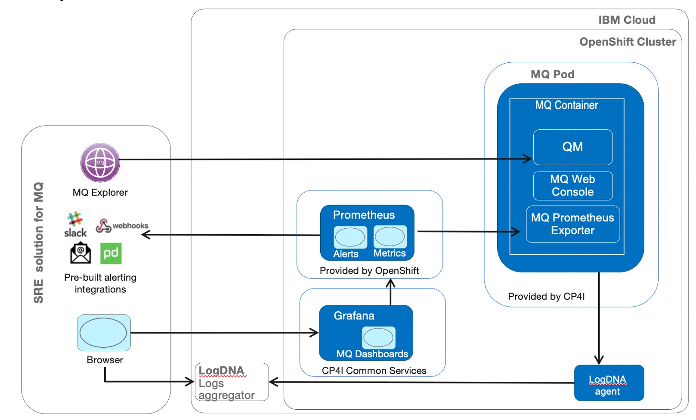
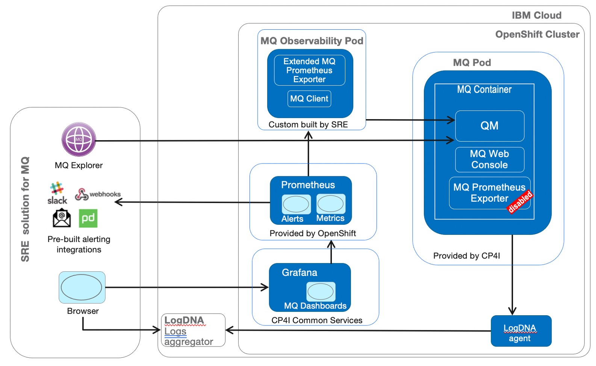
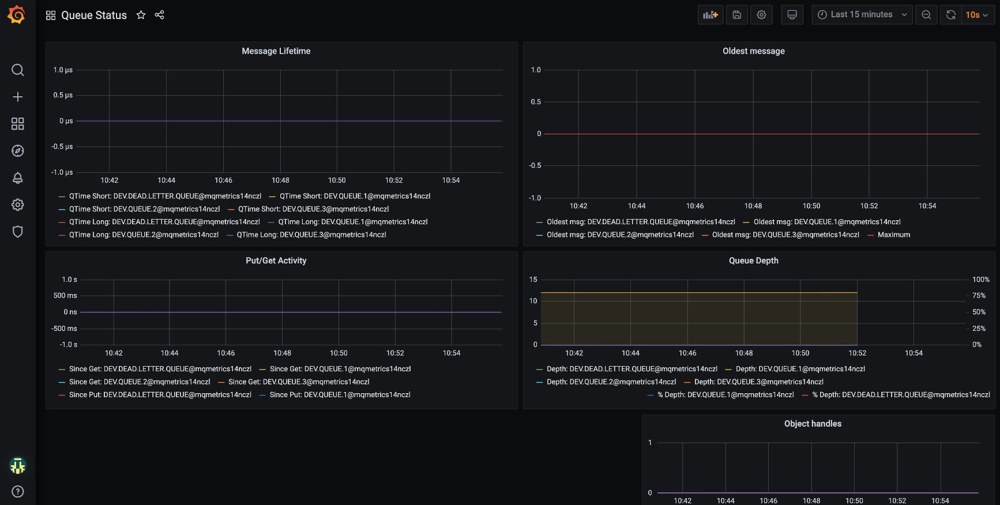
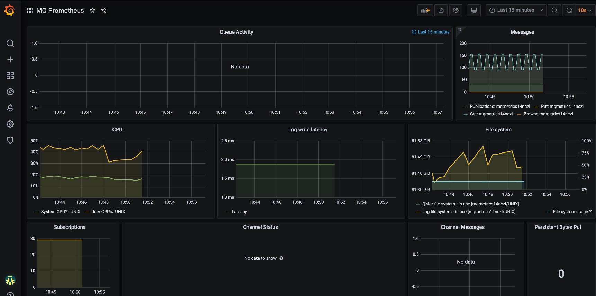

# MQ Observability in Cloud Pak for Integration

This repo describes SRE solution for MQ observability in Cloud Pak for Integration.
It is based on "out of the box" monitoring capabilities that come with CP4I deployed on OpenShift on IBM Cloud ("ROKS"). For non-IBM cloud, the core solution will work the same way.
Observability solution based on 3rd party monitoring tools are not in scope.

## Basic MQ Observability

The basic "out of the box" observability solution uses integrated MQ Prometheus Exporter that can be enabled when Queue Manager is created in CP4I. The base SRE solution is shown below  
   


Base MQ metrics are exposed from the standard MQ Pod depoloyed by CP4I at standard /metrics http endpoint automatically enabled on MQ Pod. 

Next we need a Prometheus instance to consume these metrics. There are multiple options for this
- Pre-configured Prometheus provided by OpenShift for monitoring user workloads.  This instance is pre-configured with a set of alerting integrations such as Slack, Pager Duty, email, generic webhook that allows further integration with many other compatible alreting services such as IBM Netcool Operations Insight (NOI) and many others.  
- Use Prometheus instance provided by Common services that are part of CP4I.  It seems this option is shifting towards using OpenShift - provided Prometheus for user workloads
- DYI Prometheus can be easily installed via Prometheus community operator. This may be a good starting option for a POC, but it does not provide an easy way to configure Alert manager which is not very straightforward.  

For more guidance on setting up Prometheus please refer to   
https://cloudpak8s.io/day2/EventManagement/

Next we need a Grafana instance with MQ metrics dashboard.  Again, there are several option to get a Grafana in CP4I cluster
- Use Grafan instance provided by Common services that are part of CP4I.  It seems this option is now integrated with OpenShift-provided Prometheus service for user workloads. This option WAS NOT TESTED here, but seems like a good option to pursue.
- Use DIY Grafana installed via Grafana community operator. 

For further details see   
https://cloudpak8s.io/day2/Monitoring/

Logging solution options include
- Use extral logging service. For IBM Cloud this is LogDNA service,  integrated with a one button click for OpenShift Cluster running on IBM Cloud.
- Use ELK logging stack that is part of Common Services included with CP4I.  I can't see a single reason why this part of Common Services would be used for loggging when running in cloud environment.

For further details refer to   
https://cloudpak8s.io/day2/Logging/


## The problem with Basic MQ Observability

Built-in MQ Prometheus Exporter provides many metrics, but falls short when it comes to metrics that matter most for SRE.  For example, such essential metric as queue depth, as well as may other object-level MQ metrics are not exposed.

## Extended MQ Observability

The functional SRE solution is based on an extended MQ Metrics Exporter   

https://github.com/ibm-messaging/mq-metric-samples

This is "upstream" code base for MQ Prometheus Exporter included in the product, but has latest and greatest additions, including missing metrics such as queue depth.  This exporter is to be compiled into a native executable following instructions in the repo above.  It can be deployed in 2 modes
- Server mode, when extended exporter is embedded in MQ container and executed as MQ service. This is not the preferred option, as we would want to avoid customizing standard MQ container provided by CP4I.  This mode was tested by us, and we found an issue when our desired queue-depth metric has intermittenty dissaper on and off.  This issue is further discussed here https://github.com/ibm-messaging/mq-metric-samples/issues/28

- Client mode, when extended exporter is implemeneted as a separate container running outside the monitored MQ Queue Manager using MQ redistributable client to connect to the QM.  This option does not require any customization of the standard MQ container and also does not exhibit the intermittent problem with disappearing metrics we saw with the server mode.  The extended SRE Solution is shown below  
 



The sample Grafana dashboards are included in the repo above  
https://github.com/ibm-messaging/mq-metric-samples/tree/master/cmd/mq_prometheus






## Building Extended MQ Observability Pod

Follow the    ```Dockerfile```  to build the image of extended MQ observability pod.

1.  Download MQ redistributable client v9.2.  A recent version as of Dec 2020 is included in ```/dep``` folder
2.  Build Linux native binary of extended MQ exporter following the instructions in https://github.com/ibm-messaging/mq-metric-samples  A recent build as of December 2020 is included in ```/dep``` folder
3.  Build the image and deploy using the exposed environment variables:
```
ENV MQSERVER #standard MQ env.var pointing to the target Queue Manager 
ENV MQSSLKEYR #points to TLS 1.2 artifacts to connect to QM  
ENV MQCCDTURL #Location of CCDT json file
ENV QUEUE_MANAGER #Queue Manager 
ENV QUEUE_MANAGER_CHANNEL #Channel
ENV QUEUE_MANAGER_CCDT #Location of CCDT json file TODO: Check if duplicate
ENV QUEUES_MONITORED=  #Queues selection stanza e.g. TEST.*
```

If you wish to use Server mode to install Extended MQ Exporter, follow 
`Dockerfile.server`


